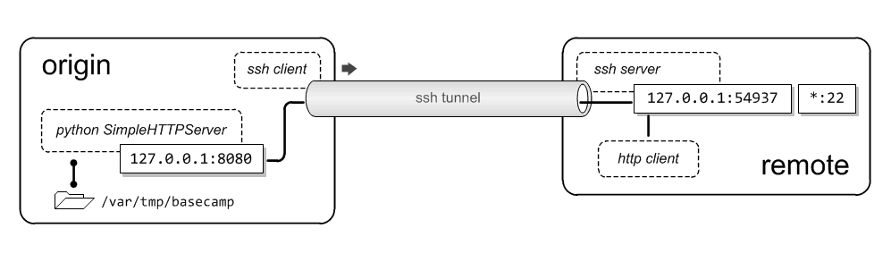

# SSH Reachback

### Motivation
Allow an application or user to access files on the source host without a lot of extra commands.  Http protocol would be nice because it's ubiquitous in nature and many userland applications use it.  Additionally, the web server and its traffic should be transported inside the ssh tunnel and only accessible from the remote host.
A concept called ssh carrier (ControlMaster) is proposed to provide flexibility and portability for different deployment scenarios.

### Behavior
A single directory on the origin host is made accessible via http through a reverse ssh tunnel.  When _sshrb_ is invoked, a small python web server started on the origin host and binds to a randomly selected port.  An ssh tunnel is established which forwards traffic from an arbitrarily selected port on the remote host to the randomly selected port where the web server is listening.  Now, user applications on the remote host can access the web server running from the origin host.
Upon exiting the ssh session, _sshrb_ terminates the web server and tears down the ssh tunnel



### Usage

```bash
[titus@origin ~]$ ./sshrb titus@remote.lemmaplex.org

/var/tmp/basecamp ~~~~~~ http://localhost:54937

[titus@remote ~]$ wget http://localhost:54937
[titus@remote ~]$ exit
```

### Features
- arbitrarily chooses an open port for http on the origin host
- attempts IPv6 first, then falls back to IPv4
- syntax is interoperable with ssh
